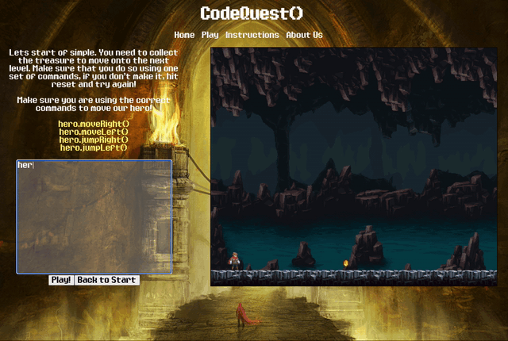
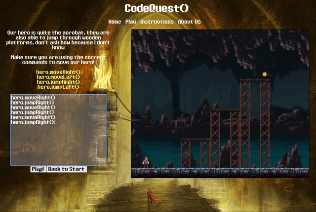
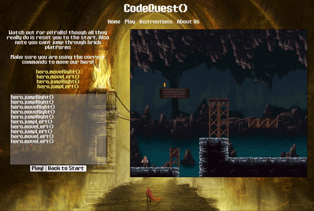
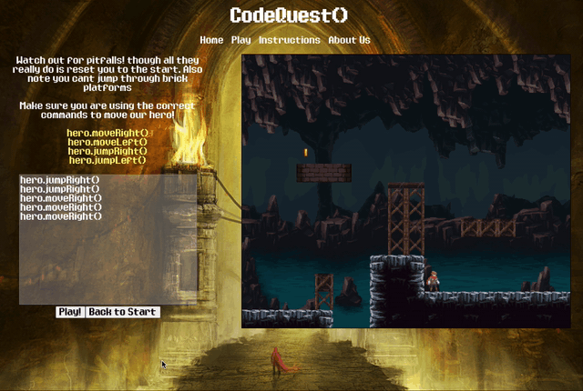
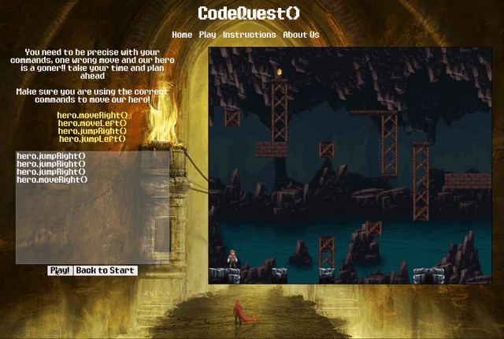
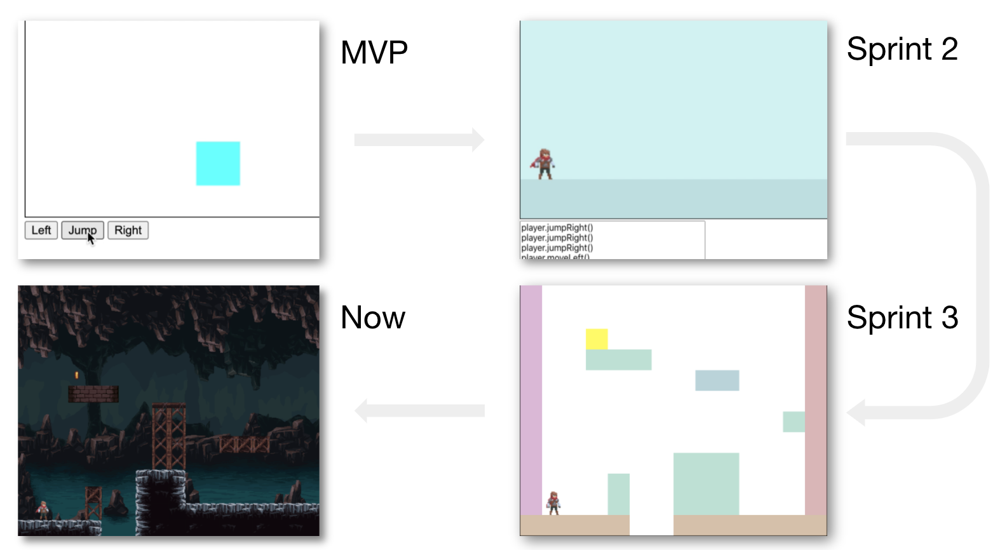

<div align="center">

<br><br>

[](https://travis-ci.com/ChrisCooney05/codeQuest)
[](https://app.netlify.com/sites/lets-codequest/deploys)

[How to Play](#how-to-play) | [Team codeQuest()](<#Team-codeQuest()>) | [Approach](#approach) | [Technologies](#technologies) | [Installing Locally](#installing-locally) | [Additional Features](#additional-features)

</div>

Welcome to codeQuest(), if you would like to give our game a try you can play it [here](https://lets-codequest.netlify.app/play) (_tap "x" to mute_).

This game also won [Best Project of August](https://careerkarma.com/discussions/projects/codequest-174/) as voted by the Career Karma community.

The goal of this project is to teach basic problem solving concepts to young children, while introducing them to some basic programming syntax. It is a platform game like many others - but with a twist. You must run and jump across the map in order to collect the coins and clear the levels; but instead of moving your player using keystrokes, you enter commands into a terminal and watch as he carries them out one at a time.

A lot of thought was put into the sort of learning environment we wanted to create. We deliberately did not include time limits, health bars or a finite number of lives. The point of this game is to fail. You are not supposed to instinctively know the right sequence of commands to pass a level - like every budding software engineer you must start small, try a few things out, figure out what works and continuously iterate until you reach a full working solution.

## How to Play

Players are presented with an avatar (the ‘Hero’) which they can control by entering commands into the terminal and clicking the “Play” button. The avatar can perform simple movements by responding to single commands:



By creating a chain of multiple commands, the hero can perform more complex movements that allow him to jump onto or over obstacles within the level:



A level is cleared by collecting the golden coin. Once a coin is collected, a new and more complex level is rendered:



If the player does not clear the level with the set of commands they have entered, they can send the hero back to the starting position without resetting the commands by clicking the “Back to Start” button:



If the hero falls down a hole then he is sent back to the starting position of the same level:



## Team codeQuest()

[Emanuele Pace](https://github.com/Emanuele-20)<br/>
[Benedetta Arinci](https://github.com/BeneArinci)<br/>
[Anthony Donovan](https://github.com/ad13380)<br/>
[Chris Cooney](https://github.com/ChrisCooney05)<br/>

## Approach

With React and game development being relatively new concepts to the team, we opted to approach this project by first utilising our existing Javascript knowledge to build out some of the core features. From this point, we decided on a list of features that we could conceivably implement within the 2 week project timeframe and began ordering them by importance. Through a series of 2 days sprints, we incrementally added functionality to our program leading up to its current incarnation.
As a result of our development style, many of the initial features were spiked. Once we were more confident with the various game development concepts, we went through our existing code base and methodically refactored and tested each feature.

Our initial prototype was focused around the implementation of basic game physics. From there, we began adding avatar animation that responded to avatar speed and direction. We then introduced level obstacles which involved more complex game physics and collision detection. We finally worked on level design and styling the various components.



## Technologies

| Area                 | Technology             |
| -------------------- | ---------------------- |
| Front end            | React                  |
| Languages used       | Javascript, HTML5, CSS |
| CI/CD                | Travis                 |
| Hosting              | Netflify               |
| Styling              | CSS, Tachyons          |
| Testing and Coverage | Jest                   |

## Installing Locally

If you would rather play the game locally, or if you want to play with the source code you can do the following.

1. Please clone this repo to your local machine (or fork then clone if you want to store a copy on your own repo)
2. Run the following command to install dependencies <br/>
   ```
   npm install
   ```
3. You have a few out the box scripts you can run
   ```
   npm test
   npm start
   ```
   npm test will run all tests <br/>
   npm start will boot the server to port 3000 for you to play the game locally.

## Additional Features

With a longer project timeline, we would also like to have implemented:

- Moving obstacles within some of the levels
- Different ways of creating command chains, such as with the use of while loops
- More types of avatar movements such as climbing
